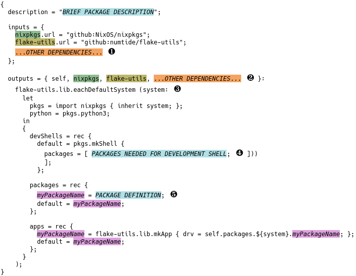

# A generic flake

The previous section presented a very high-level view of flakes, focusing on the basic structure.
In this section, we will add a bit more detail.

Flakes are written in the Nix programming language, which is a functional language.
As with most programming languages, there are many ways to achieve the same result.
Below is an example you can follow when writing your own flakes.
I'll explain the example in some detail.

We discussed how to specify flake inputs ❶ in the previous section, so this part of the flake should be familiar.
Remember also that any dependencies in the input section should also be listed at the beginning
of the outputs section ❷.

Now it's time to look at the content of the output section.
If we want the package to be available for multiple systems (e.g., "x86_64-linux", "aarch64-linux", "x86_64-darwin", and "aarch64-darwin"),
we need to define the output for each of those systems.
Often the definitions are identical, apart from the name of the system.
The eachDefaultSystem function ❸ provided by flake-utils allows us to write a single definition using a variable for the system name. The function then iterates over all default systems to generate the outputs for each one.

The `devShells` variable specifies the environment that should be available when doing development on the package.
If you don't need a special development environment, you can omit this section.
At ❹ you would list any tools (e.g., compilers and language-specific build tools) you want to have available in a development shell.
If the compiler needs access to language-specific packages, there are Nix functions to assist with that.
These functions are very language-specific, and not always well-documented.
We will see examples for some languages later in the tutorial.
In general, I recommend that you do a web search for "nix language", and try to find resources that were written or updated recently.

The `packages` variable defines the packages that this flake provides.
The package definition ❺ depends on the programming languages your software is written in, the build system you use, and more.
There are Nix functions and tools that can simplify much of this, and new, easier-to-use ones are released regularly.
Again, I recommend that you do a web search for "nix language", and try to find resources that were written or updated recently.

The list below contains are a few functions that are commonly used in this section.

General-purpose
  : The standard environment provides `mkDerivation`, which is especially useful for the typical ./configure; make; make install scenario.
    It's customisable.

Python
  : `buildPythonApplication`, `buildPythonPackage`.

Haskell
  : `mkDerivation` (Haskell version, which is a wrapper around the standard environment version), `developPackage`, `callCabal2Nix`.

